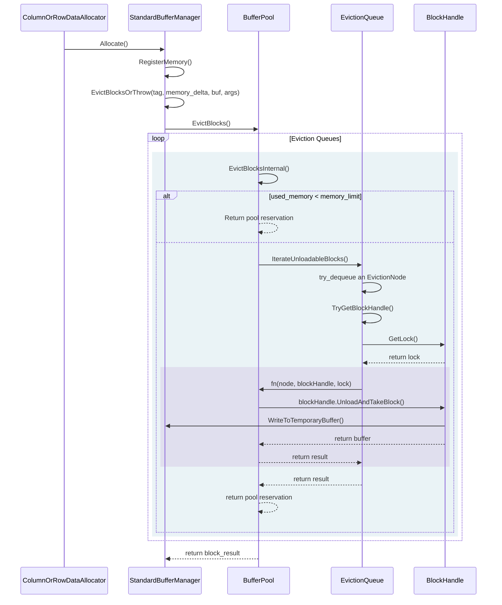

# Buffer Manager

In here we are going to describe how the `BufferManager` works, to be specific, when and how it decides to spill memory blocks to disk. 

The `BufferManager` in DuckDB is an abstract class. For that reason our attention is shifted towards the concrete implementation in DuckDB, called `StandardBufferManager`(SBM).

The `ColumnOrRowDataAllocator` represents the two type of memory allocators for DuckDB that the physical operators interacts with. These two classes are called `ColumnDataAllocator` and `RowDataAllocator`.

## Descriptions of functions

### `StandardBufferManager`

#### `EvictBlocksOrThrow()`

It has four parameters:

- `MemoryTag tag`
- `idx_t memory_delta`
- `unique_ptr<FileBuffer>` *buffer
- `ARGS... args`

It doesn't do much. It calls the `BufferPool::EvictBlocks()` function and delegates the responsibility of allocating a block of memory. If a block of memory is returned it will `Pin` the block

### `BufferPool`

#### `EvictBlocks()`

It has four parameters:

- `MemoryTag tag`
- `idx_t extra_memory`
- `idx_t memory_limit`
- `unique_ptr<FileBuffer>` *buffer

It calls the `EvictBlocksInternal()` for each eviction queue until a successful result is returned or that the last queue is reached. 

**What is a successful result?**

A successful result is when the `EvictBlocksInternal()` returns an `EvictionResult` with `true`.

#### `EvictBlocksInternal()`

This function has three steps:

a. Check if there is available space of memory that can be used
