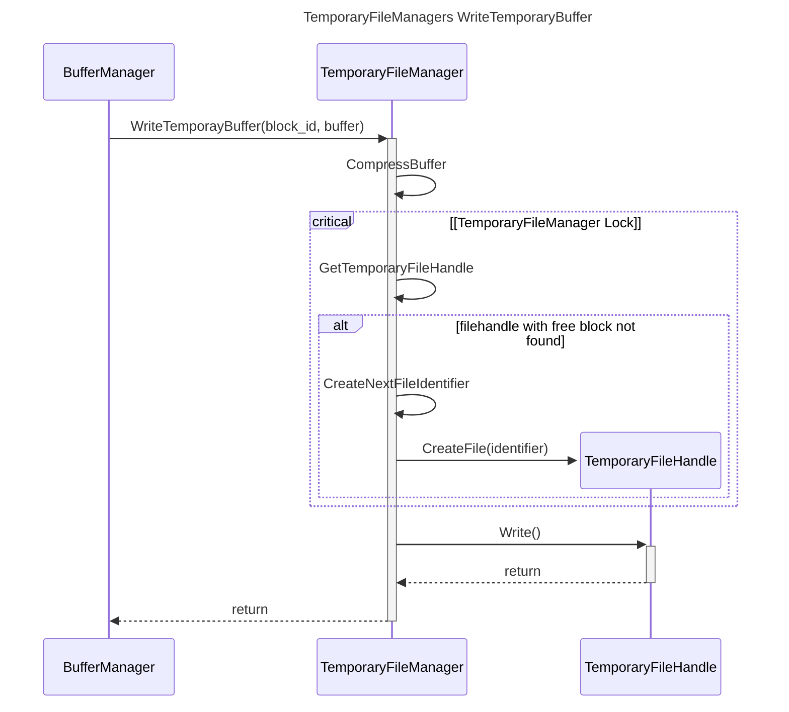
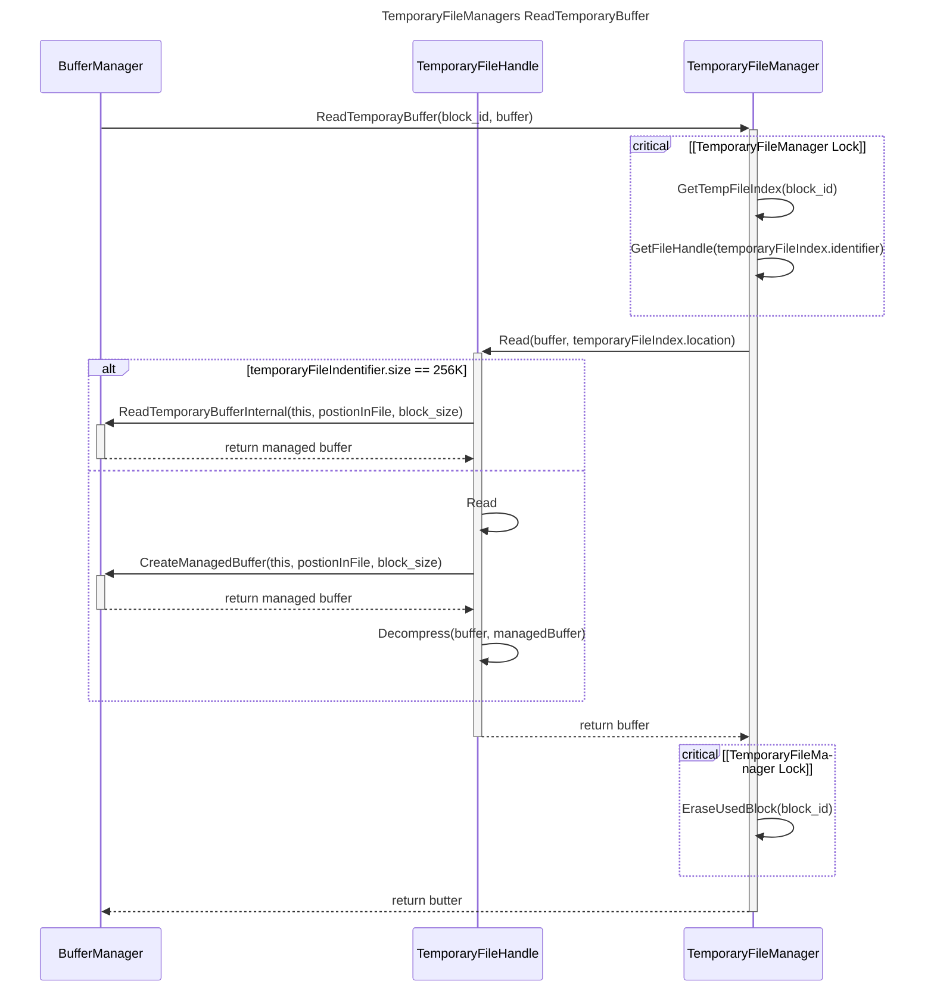

# TemporaryFileManager

# WriteTemporaryBuffer

```mermaid
---
title: TemporaryFileManagers WriteTemporaryBuffer
---
sequenceDiagram
    BufferManager ->>+ TemporaryFileManager: WriteTemporayBuffer(block_id, buffer)

    TemporaryFileManager ->> TemporaryFileManager: CompressBuffer
    critical [TemporaryFileManager Lock]
        TemporaryFileManager ->> TemporaryFileManager: GetTemporaryFileHandle
        alt filehandle with free block not found
            TemporaryFileManager ->> TemporaryFileManager: CreateNextFileIdentifier
            create participant TemporaryFileHandle
            TemporaryFileManager ->> TemporaryFileHandle: CreateFile(identifier)
        end
    end

    TemporaryFileManager ->>+ TemporaryFileHandle: Write()
    TemporaryFileHandle -->>- TemporaryFileManager: return
    TemporaryFileManager -->>- BufferManager: return
```

```mermaid
---
title: TemporaryFileManagers ReadTemporaryBuffer 
---
sequenceDiagram
    participant BufferManager
    participant TemporaryFileHandle
    participant TemporaryFileManager

    BufferManager ->>+ TemporaryFileManager: ReadTemporayBuffer(block_id, buffer)

    critical [TemporaryFileManager Lock]
        TemporaryFileManager ->> TemporaryFileManager: GetTempFileIndex(block_id)
        TemporaryFileManager ->> TemporaryFileManager: GetFileHandle(temporaryFileIndex.identifier)
    end
    TemporaryFileManager ->>+ TemporaryFileHandle: Read(buffer, temporaryFileIndex.location)
    alt temporaryFileIndentifier.size == 256K
        TemporaryFileHandle ->>+ BufferManager: ReadTemporaryBufferInternal(this, postionInFile, block_size)
        BufferManager -->>- TemporaryFileHandle: return managed buffer
    else
        TemporaryFileHandle ->> TemporaryFileHandle: Read
        TemporaryFileHandle ->>+ BufferManager: CreateManagedBuffer(this, postionInFile, block_size)
        BufferManager -->>- TemporaryFileHandle: return managed buffer
        TemporaryFileHandle ->> TemporaryFileHandle: Decompress(buffer, managedBuffer)
    end
    TemporaryFileHandle -->>- TemporaryFileManager: return buffer
    
    critical [TemporaryFileManager Lock]
        TemporaryFileManager ->> TemporaryFileManager: EraseUsedBlock(block_id)
    end
    TemporaryFileManager -->>- BufferManager: return butter
```