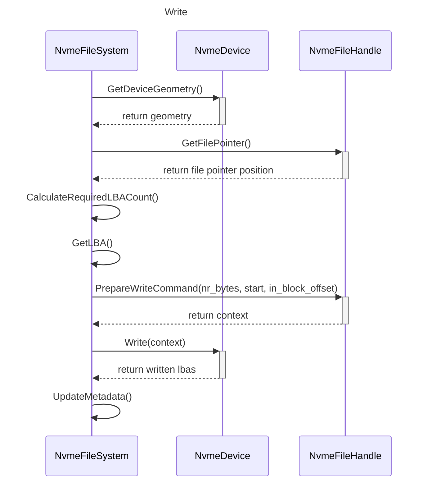
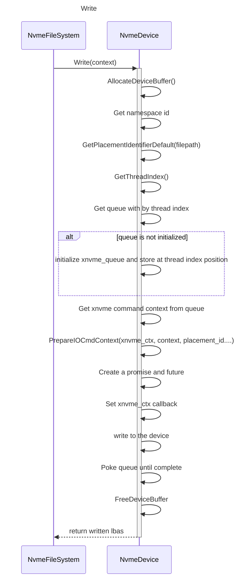

```mermaid
---
title: Write
---
sequenceDiagram
    NvmeFileSystem ->>+ NvmeDevice: GetDeviceGeometry()
    NvmeDevice -->>- NvmeFileSystem: return geometry
    NvmeFileSystem ->>+ NvmeFileHandle: GetFilePointer()
    NvmeFileHandle -->>- NvmeFileSystem: return file pointer position
    NvmeFileSystem ->> NvmeFileSystem: CalculateRequiredLBACount()
    NvmeFileSystem ->> NvmeFileSystem: GetLBA()

    NvmeFileSystem ->>+ NvmeFileHandle: PrepareWriteCommand(nr_bytes, start, in_block_offset)
    NvmeFileHandle -->>- NvmeFileSystem: return context

    NvmeFileSystem ->>+ NvmeDevice: Write(context)
    NvmeDevice -->>- NvmeFileSystem: return written lbas

    NvmeFileSystem ->> NvmeFileSystem: UpdateMetadata()
```

```mermaid
---
title: Write
---
sequenceDiagram
    NvmeFileSystem ->>+ NvmeDevice: Write(context)
    NvmeDevice ->> NvmeDevice: AllocateDeviceBuffer()
    NvmeDevice ->> NvmeDevice: Get namespace id
    NvmeDevice ->> NvmeDevice: GetPlacementIdentifierDefault(filepath)
    NvmeDevice ->> NvmeDevice: GetThreadIndex()
    NvmeDevice ->> NvmeDevice: Get queue with by thread index
    alt queue is not initialized
        NvmeDevice ->> NvmeDevice: initialize xnvme_queue and store at thread index position
    end
    NvmeDevice ->> NvmeDevice: Get xnvme command context from queue
    NvmeDevice ->> NvmeDevice: PrepareIOCmdContext(xnvme_ctx, context, placement_id....)
    NvmeDevice ->> NvmeDevice: Create a promise and future
    NvmeDevice ->> NvmeDevice: Set xnvme_ctx callback
    NvmeDevice ->> NvmeDevice: write to the device
    NvmeDevice ->> NvmeDevice: Poke queue until complete
    NvmeDevice ->> NvmeDevice: FreeDeviceBuffer

    NvmeDevice -->>- NvmeFileSystem: return written lbas
```