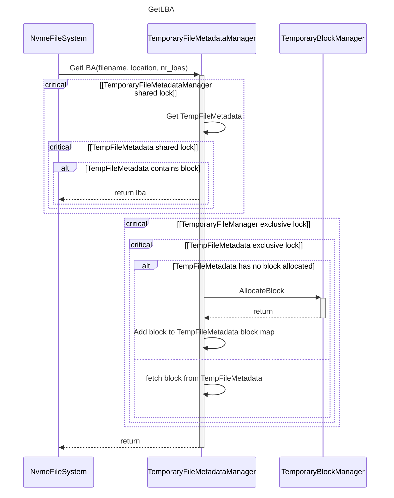
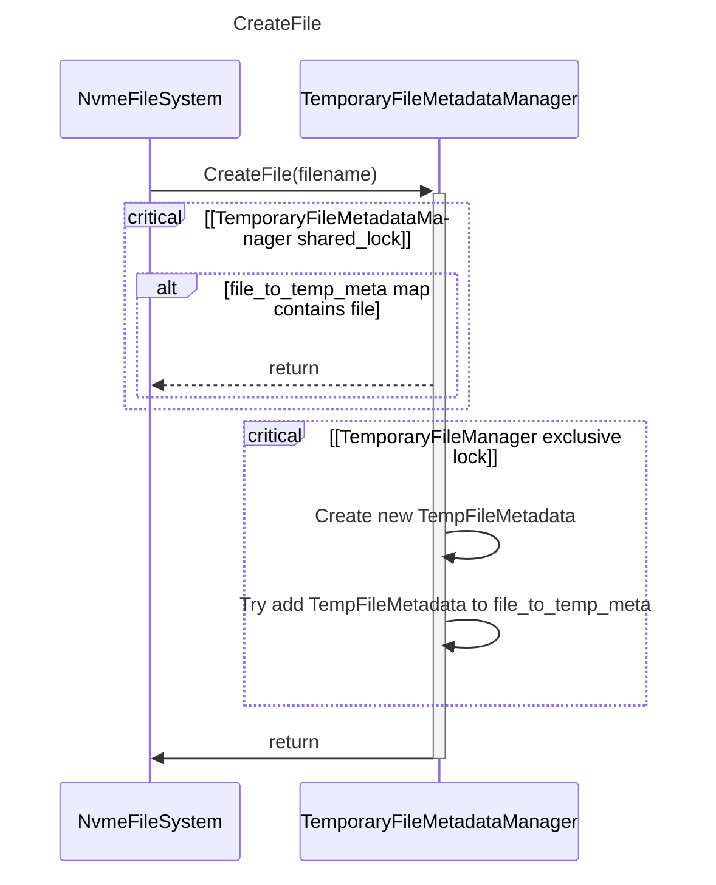
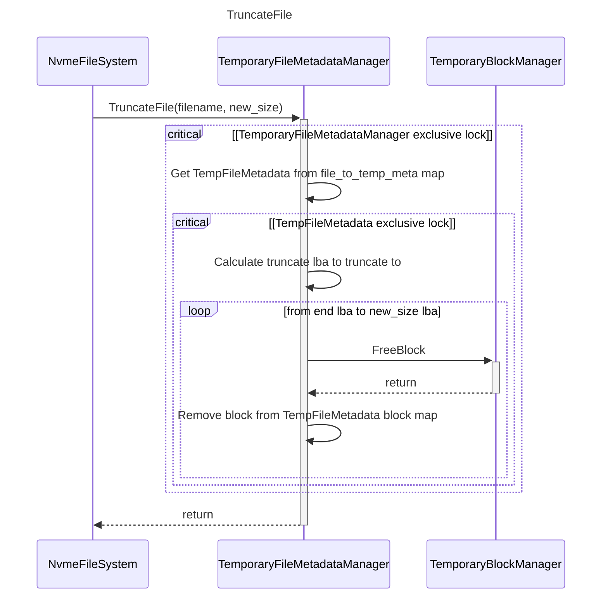
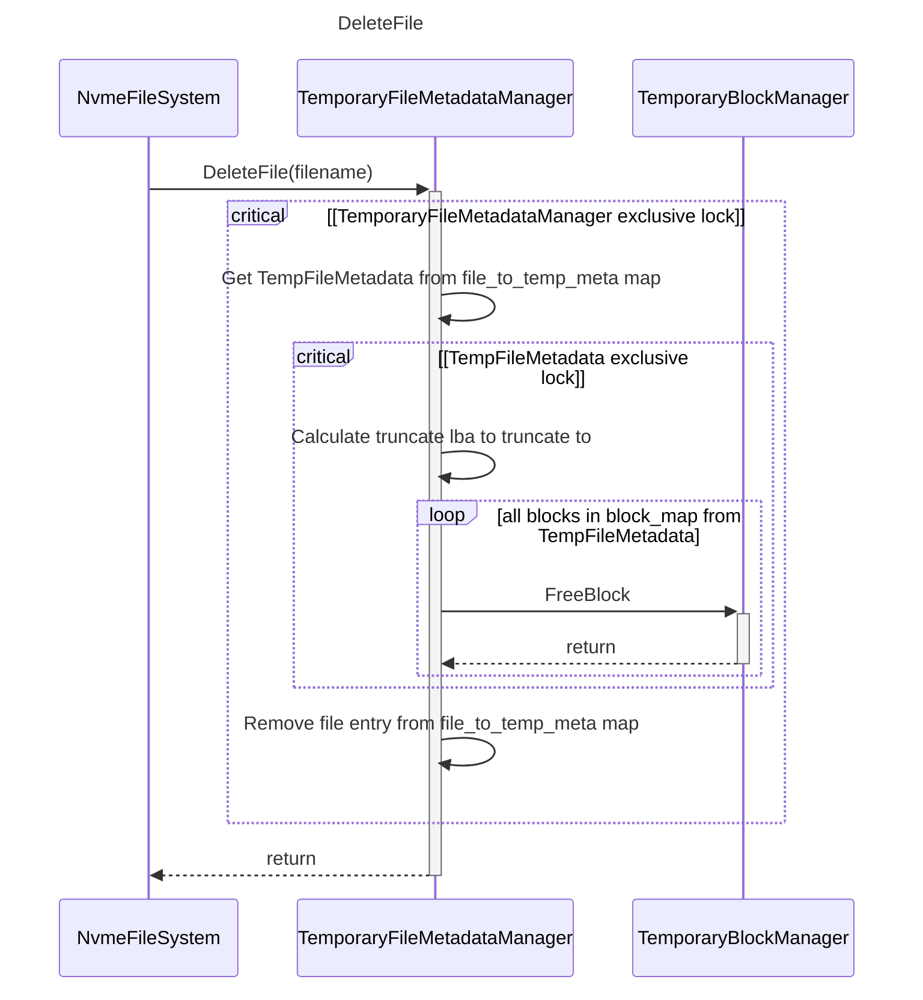
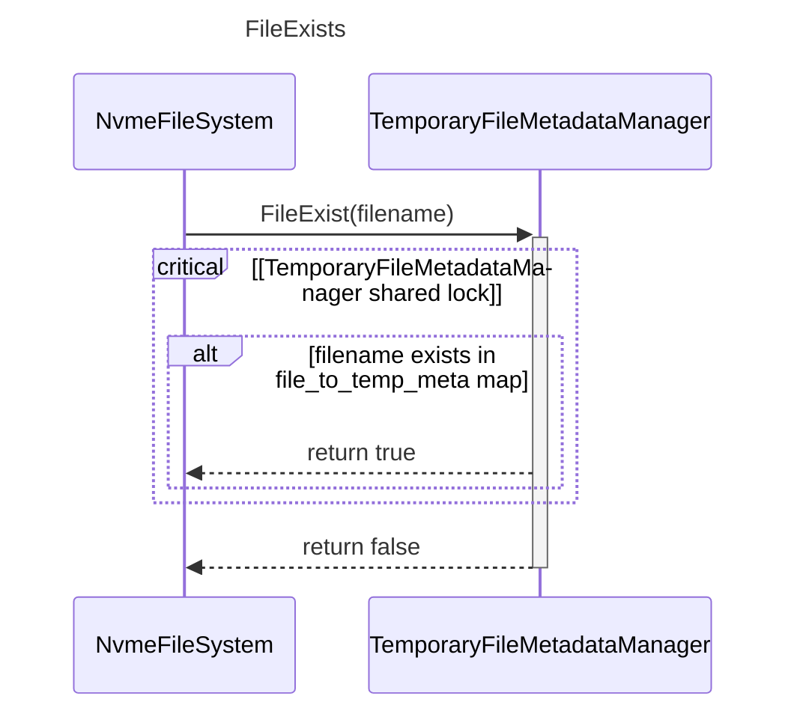
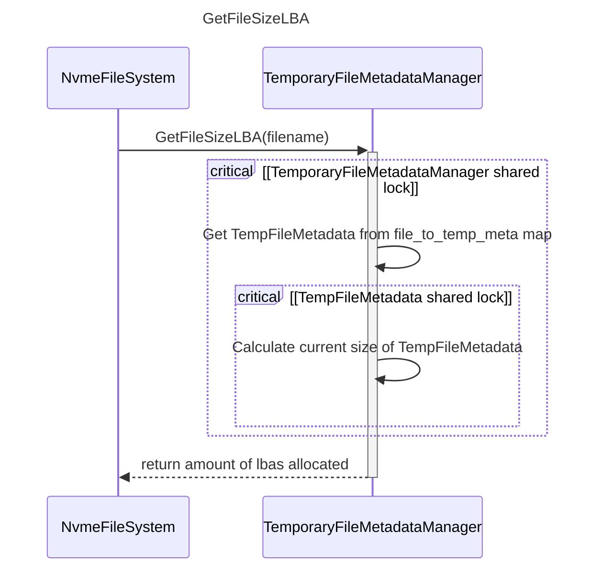
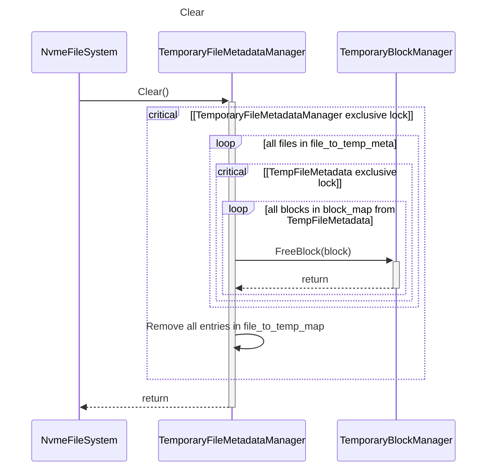
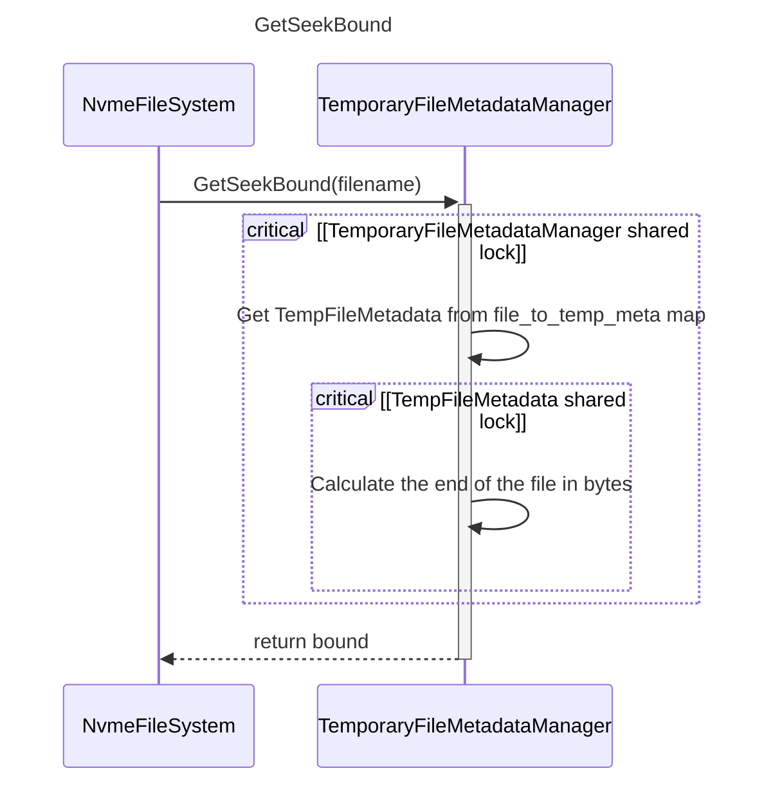
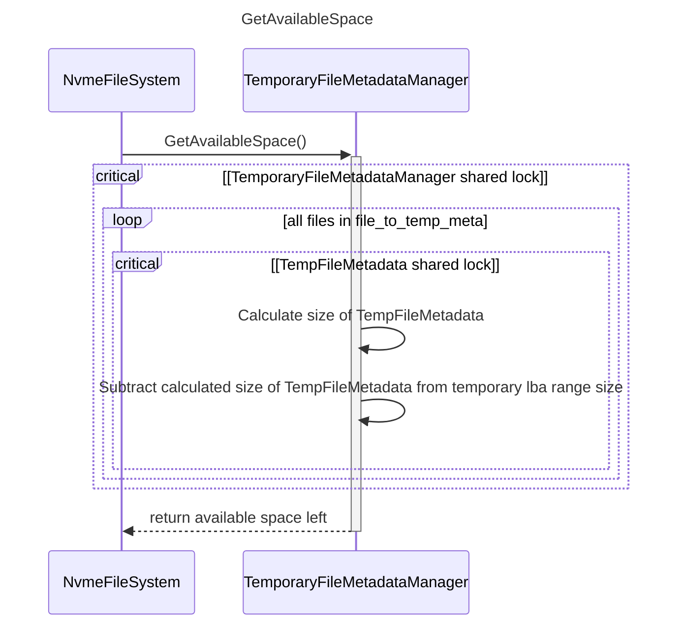
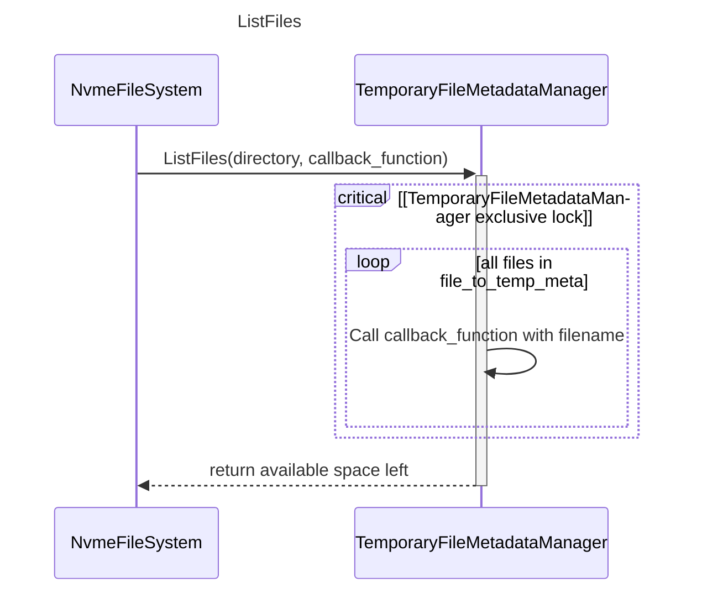

```mermaid
---
title: GetLBA
---
sequenceDiagram
    NvmeFileSystem ->>+ TemporaryFileMetadataManager:GetLBA(filename, location, nr_lbas)
    critical [TemporaryFileMetadataManager shared lock]
        TemporaryFileMetadataManager ->> TemporaryFileMetadataManager: Get TempFileMetadata

        critical [TempFileMetadata shared lock]
            alt  TempFileMetadata contains block
                TemporaryFileMetadataManager -->> NvmeFileSystem: return lba
            end
        end

    end

    critical [TemporaryFileManager exclusive lock]
        critical [TempFileMetadata exclusive lock]

            alt TempFileMetadata has no block allocated
                TemporaryFileMetadataManager ->>+ TemporaryBlockManager: AllocateBlock
                TemporaryBlockManager -->>- TemporaryFileMetadataManager: return

                TemporaryFileMetadataManager ->> TemporaryFileMetadataManager: Add block to TempFileMetadata block map
            else
                TemporaryFileMetadataManager ->> TemporaryFileMetadataManager: fetch block from TempFileMetadata
            end

        end
    end

    TemporaryFileMetadataManager -->>- NvmeFileSystem: return
```

```mermaid
---
title: CreateFile
---
sequenceDiagram
    NvmeFileSystem ->>+ TemporaryFileMetadataManager:CreateFile(filename)
    critical [TemporaryFileMetadataManager shared_lock]
        alt file_to_temp_meta map contains file
            TemporaryFileMetadataManager -->> NvmeFileSystem: return
        end
    end

    critical [TemporaryFileManager exclusive lock]
        TemporaryFileMetadataManager ->> TemporaryFileMetadataManager: Create new TempFileMetadata
        TemporaryFileMetadataManager ->> TemporaryFileMetadataManager: Try add TempFileMetadata to file_to_temp_meta
    end
    TemporaryFileMetadataManager ->>- NvmeFileSystem: return
```

```mermaid
---
title: TruncateFile
---
sequenceDiagram
    NvmeFileSystem ->>+ TemporaryFileMetadataManager:TruncateFile(filename, new_size)
    critical [TemporaryFileMetadataManager exclusive lock]
        TemporaryFileMetadataManager ->> TemporaryFileMetadataManager: Get TempFileMetadata from file_to_temp_meta map
        critical [TempFileMetadata exclusive lock]
            TemporaryFileMetadataManager ->> TemporaryFileMetadataManager: Calculate truncate lba to truncate to
            loop from end lba to new_size lba
                TemporaryFileMetadataManager ->>+ TemporaryBlockManager: FreeBlock
                TemporaryBlockManager -->>- TemporaryFileMetadataManager: return
                TemporaryFileMetadataManager ->> TemporaryFileMetadataManager: Remove block from TempFileMetadata block map
            end
        end
    end
    TemporaryFileMetadataManager -->>- NvmeFileSystem: return

```

```mermaid
---
title: DeleteFile
---
sequenceDiagram
    NvmeFileSystem ->>+ TemporaryFileMetadataManager:DeleteFile(filename)
    critical [TemporaryFileMetadataManager exclusive lock]
        TemporaryFileMetadataManager ->> TemporaryFileMetadataManager: Get TempFileMetadata from file_to_temp_meta map
        critical [TempFileMetadata exclusive lock]
            TemporaryFileMetadataManager ->> TemporaryFileMetadataManager: Calculate truncate lba to truncate to
            loop all blocks in block_map from TempFileMetadata 
                TemporaryFileMetadataManager ->>+ TemporaryBlockManager: FreeBlock
                TemporaryBlockManager -->>- TemporaryFileMetadataManager: return
            end
        end

        TemporaryFileMetadataManager ->> TemporaryFileMetadataManager: Remove file entry from file_to_temp_meta map
    end

    TemporaryFileMetadataManager -->>- NvmeFileSystem: return
```

```mermaid
---
title: FileExists
---
sequenceDiagram
    NvmeFileSystem ->>+ TemporaryFileMetadataManager:FileExist(filename)
    critical [TemporaryFileMetadataManager shared lock]
        alt filename exists in file_to_temp_meta map
            TemporaryFileMetadataManager -->> NvmeFileSystem: return true
        end
    end

    TemporaryFileMetadataManager -->>- NvmeFileSystem: return false
```

```mermaid
---
title: GetFileSizeLBA
---
sequenceDiagram
    NvmeFileSystem ->>+ TemporaryFileMetadataManager:GetFileSizeLBA(filename)
    critical [TemporaryFileMetadataManager shared lock]
        TemporaryFileMetadataManager ->> TemporaryFileMetadataManager: Get TempFileMetadata from file_to_temp_meta map
        critical [TempFileMetadata shared lock]
            TemporaryFileMetadataManager ->> TemporaryFileMetadataManager: Calculate current size of TempFileMetadata

        end
    end

    TemporaryFileMetadataManager -->>- NvmeFileSystem: return amount of lbas allocated

```

```mermaid
---
title: Clear
---
sequenceDiagram
    NvmeFileSystem ->>+ TemporaryFileMetadataManager:Clear()
    critical [TemporaryFileMetadataManager exclusive lock]
        loop all files in file_to_temp_meta
            critical [TempFileMetadata exclusive lock]
                loop all blocks in block_map from TempFileMetadata 
                    TemporaryFileMetadataManager ->>+ TemporaryBlockManager: FreeBlock(block)
                    TemporaryBlockManager -->>- TemporaryFileMetadataManager: return
                end
            end
        end

        TemporaryFileMetadataManager ->> TemporaryFileMetadataManager: Remove all entries in file_to_temp_map
    end
    TemporaryFileMetadataManager -->>- NvmeFileSystem: return

```

```mermaid
---
title: GetSeekBound
---
sequenceDiagram
    NvmeFileSystem ->>+ TemporaryFileMetadataManager:GetSeekBound(filename)
    critical [TemporaryFileMetadataManager shared lock]
        TemporaryFileMetadataManager ->> TemporaryFileMetadataManager: Get TempFileMetadata from file_to_temp_meta map

        critical [TempFileMetadata shared lock]

            TemporaryFileMetadataManager ->> TemporaryFileMetadataManager: Calculate the end of the file in bytes
        end
    end

    TemporaryFileMetadataManager -->>- NvmeFileSystem: return bound
```

```mermaid
---
title: GetAvailableSpace
---
sequenceDiagram
    NvmeFileSystem ->>+ TemporaryFileMetadataManager:GetAvailableSpace()
    critical [TemporaryFileMetadataManager shared lock]
        loop all files in file_to_temp_meta
            critical [TempFileMetadata shared lock]
                TemporaryFileMetadataManager ->> TemporaryFileMetadataManager: Calculate size of TempFileMetadata
                TemporaryFileMetadataManager ->> TemporaryFileMetadataManager: Subtract calculated size of TempFileMetadata from temporary lba range size
            end
        end
    end

    TemporaryFileMetadataManager -->>- NvmeFileSystem: return available space left
```

```mermaid
---
title: ListFiles
---
sequenceDiagram
    NvmeFileSystem ->>+ TemporaryFileMetadataManager: ListFiles(directory, callback_function)
    critical [TemporaryFileMetadataManager exclusive lock]
        loop all files in file_to_temp_meta
            TemporaryFileMetadataManager ->> TemporaryFileMetadataManager: Call callback_function with filename
        end
    end

    TemporaryFileMetadataManager -->>- NvmeFileSystem: return available space left
```